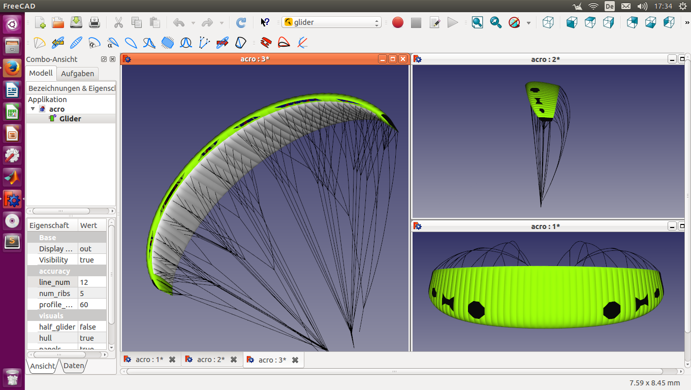
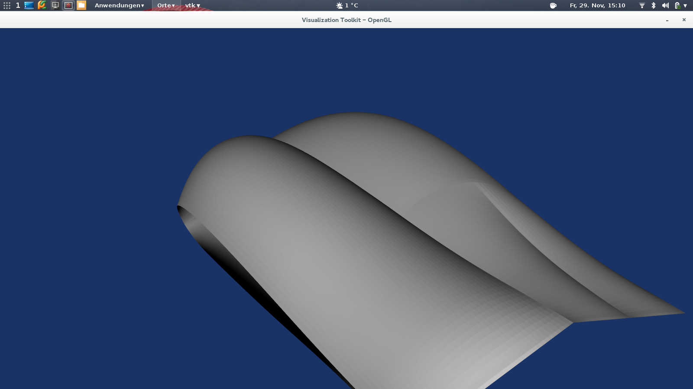

OpenGlider
==========

[](https://travis-ci.org/booya-at/OpenGlider)
[](https://coveralls.io/r/hiaselhans/OpenGlider)
[](https://readthedocs.org/projects/openglider/?badge=latest)

someday, hopefully this is open source paraglider design software


Try It
------

Clone the git-repo first:
  ```
  git clone https://github.com/hiaselhans/OpenGlider.git
  ```

Install using Pip:
  ```
  cd OpenGlider
  pip install -e .
  ```

Or manually install all dependencies (using distro-repos, easy_install or pip)
* ezodf2
* dxfwrite
* scipy
* (svgwrite)
* (vtk)


Install with conda
------------------

We are providing packages of openglider and dependencies via conda. To install conda download [miniconda](https://docs.conda.io/en/latest/miniconda.html) and follow install instructions. Once you have a working base-environment you can create a new environment for openglider:
```
conda create -n openglider openglider freecad meshpy -c conda-forge -c openglider
```


Documentation
-------------
Every module inside openglider has a README where the functionality is documented. Please have a look at the [base module](./openglider/README.md).

Unittests and Visual Tests
--------------------------

To run all unittests, run this from the main directory:
  ```
  ./testall.py
  ```

Or use -a to also run visual tests
```
./testall.py -a
```


Development Progress
--------------------

While still being in an early status, here is some little screenshots to see the progress:






The plan is to build on:

* **python** ( http://docs.python.org/2/tutorial/ )

* self-coded **panelmethod** (VSAERO) and/or apame implementation (http://www.3dpanelmethod.com/) for quick 3D-calculation
    -> https://github.com/booya-at/paraBEM

* **OpenFoam** obj-file CFD export ( http://www.openfoam.com/)

* ecplicit non linear **FEM** (membrane, truss) for line forces and deformation analysis (https://www.github.com/booya-at/paraFEM)

* **freecad** (Open-Source Cad, written in c++ with python API (www.freecadweb.org/)

* **VTK** (visual toolkit, for 3d-output: http://www.vtk.org/)

* ~~Code_Aster FEM export ( http://www.code-aster.org ) - maybe calculix as we've done already, but it does currently not support membrane elements)~~

* ~~xfoil//Pyxfoil for 2D-foil calculation ( http://web.mit.edu/drela/Public/web/xfoil/ ) (http://www.python-science.org/project/pyxfoil)~~

It will take some time, if you want to help, feel free to do so!

Using some older code, we already created a few prototypes which can be seen on www.booya.at
