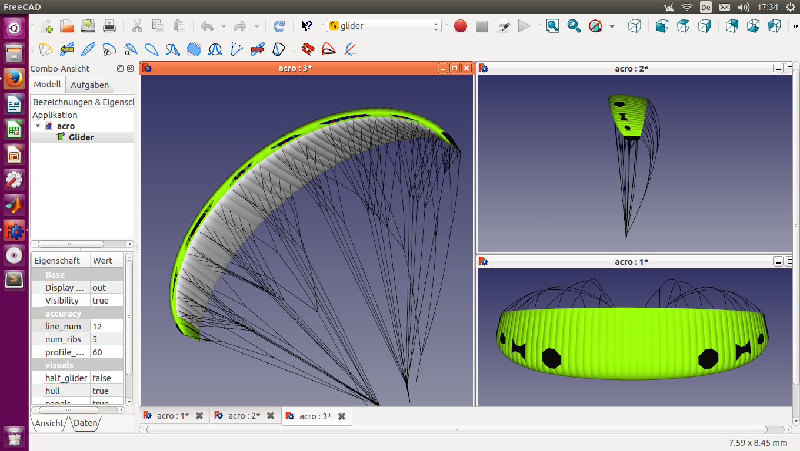
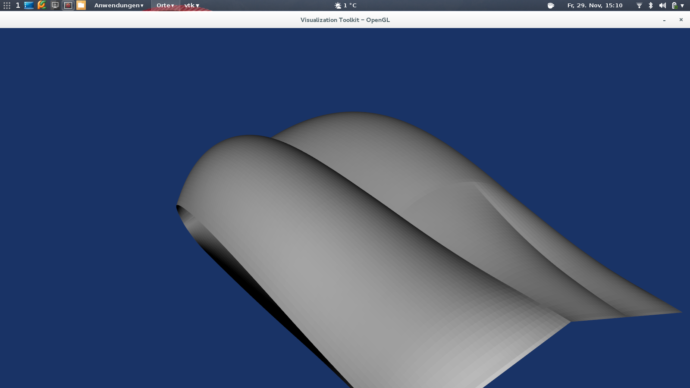
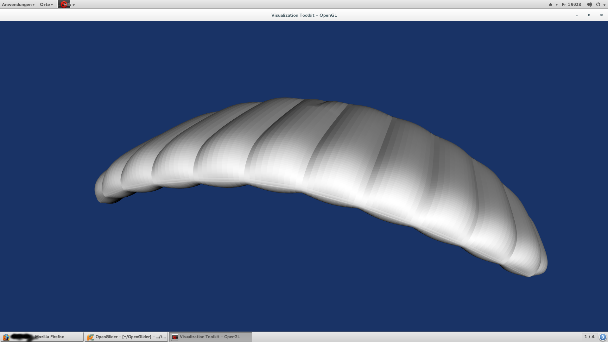
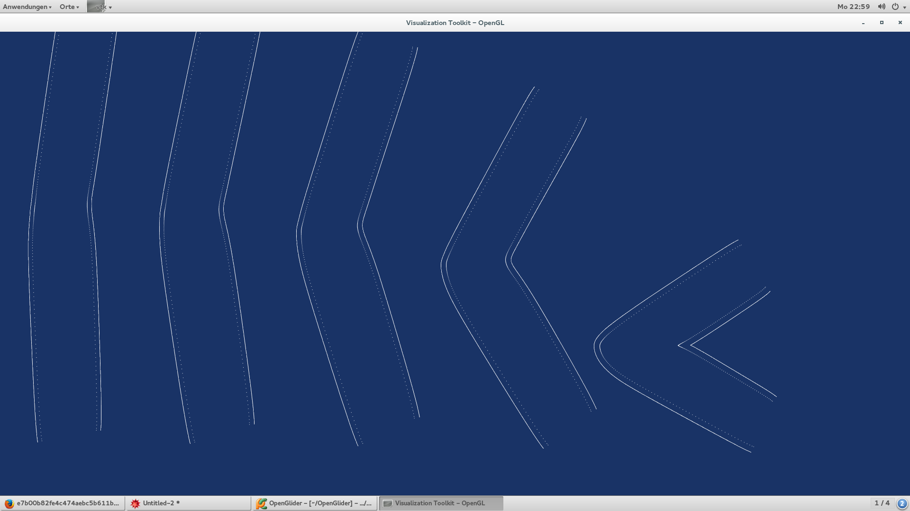
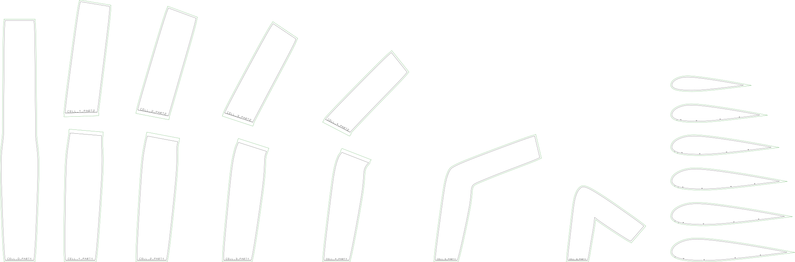

# OpenGlider

[](https://github.com/booya-at/OpenGlider/actions/workflows/tests.yml)
[](https://github.com/booya-at/OpenGlider/actions/workflows/docs.yml)

A future open source paraglider design software (still a WIP)

## Try It

Clone the git-repo first:
```bash
git clone https://github.com/hiaselhans/OpenGlider.git
```

### Install with pip
```bash
cd OpenGlider
pip install -e .
```

Or manually install all dependencies (using distro-repos, easy_install or pip)
* ezodf2
* dxfwrite
* scipy
* (svgwrite)
* (vtk)

### Install with pixi
if you have pixi installed just launch pixi and run this command 
`pixi run freecad` to launch freecad with openglider installed.

### Install with conda

We are providing packages of OpenGlider and dependencies via `conda`. To install `conda` download [miniconda](https://docs.conda.io/en/latest/miniconda.html) and follow the install instructions. Once you have a working base-environment you can create a new environment for openglider:  
```bash
conda create -n openglider openglider freecad meshpy -c conda-forge
```


## Documentation

**[Online-Dokumentation (Sphinx)](https://booya-at.github.io/OpenGlider/)** – Installation, Konzepte, FreeCAD-Workbench, API-Referenz.

Every module inside openglider *should* have a README where the functionality is documented.  
Please have a look at the [base module](./openglider/README.md).

Also have a look at the [gui-tutorial](https://booya-at.github.io/openglider-tutorial)

### Tests

Tests laufen mit **pytest**. Abhängigkeiten: `pip install -e ".[test]"` oder pixi-Environment nutzen.

| Was | Befehl |
|-----|--------|
| Nur Unit-Tests (ohne Visual/GUI) | `pytest tests/ -m "not visual"` oder `./testall.py` |
| Alle Tests inkl. Visual | `pytest tests/` oder `./testall.py -a` |
| Mit pixi | `pixi run test` (Unit) · `pixi run test-all` (alle) |

Ausführliche Beschreibung, Marker, Verzeichnisstruktur: [tests/README.md](tests/README.md).

## Development Screenshots

While still being in an early status, here are a few screenshots showing progress made so far:


glider workbench gui  


testcell with miniribs


demo kite with central minirib


demo kite plots


plots

## Roadmap
The plan is to build on the following technologies:

* **Python** ([link](http://docs.python.org/2/tutorial/))

* self-coded **panelmethod** (VSAERO) and/or apame implementation ([link](http://www.3dpanelmethod.com/)) for quick 3D-calculation (see [parabem](https://github.com/booya-at/parabem))

* **[OpenFoam](http://www.openfoam.com/)** obj-file CFD export

* **[paraFEM](https://www.github.com/booya-at/paraFEM)** - Explicit non linear **FEM** (membrane, truss) for line forces and deformation analysis 

* **[FreeCAD](https://www.freecadweb.org/)** (Open-Source Cad, written in c++ with python API 

* **[VTK](https://www.vtk.org/)** - visual toolkit for 3d-output

* ~~Code_Aster FEM export (http://www.code-aster.org) - maybe calculix as we've done already, but it does currently not support membrane elements)~~

* ~~xfoil//Pyxfoil for 2D-foil calculation (http://web.mit.edu/drela/Public/web/xfoil/) (http://www.python-science.org/project/pyxfoil)~~

It will take some time, if you want to help, feel free to do so!

Using some older code, we already created a few prototypes which can be seen on http://www.booya.at
