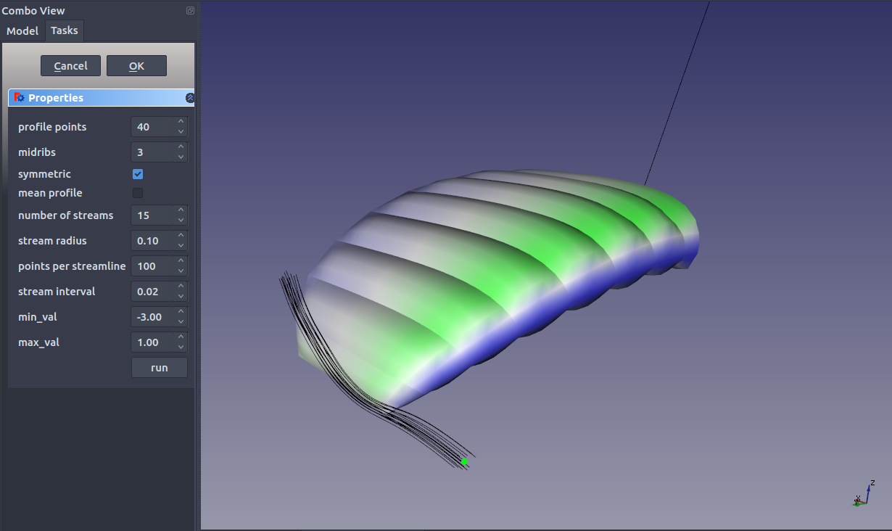
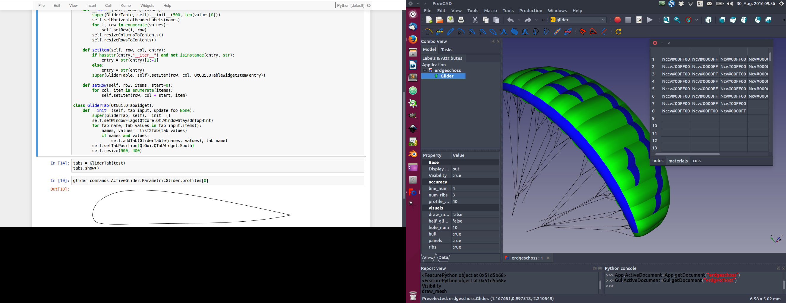
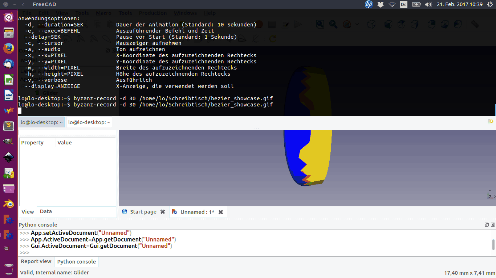

freecad_openglider
==================
Gui for OpenGlider in FreeCAD

This is a extension module for freecad.
It is built for paraglider engineering.
Openglider is one of the most advanced free and open paraglider/ kite design tools.

**Use at your own risk!**

Installation
------------

Compile custom pivy version:
[looooo/pivy](https://github.com/looooo/pivy)

install dependencies:

 * [FreeCAD](https://github.com/FreeCAD/FreeCAD)
 * [OpenGlider](https://github.com/booya-at/OpenGlider)

Install freecad_glider:

Refer to https://github.com/looooo/FCGear

   

  
