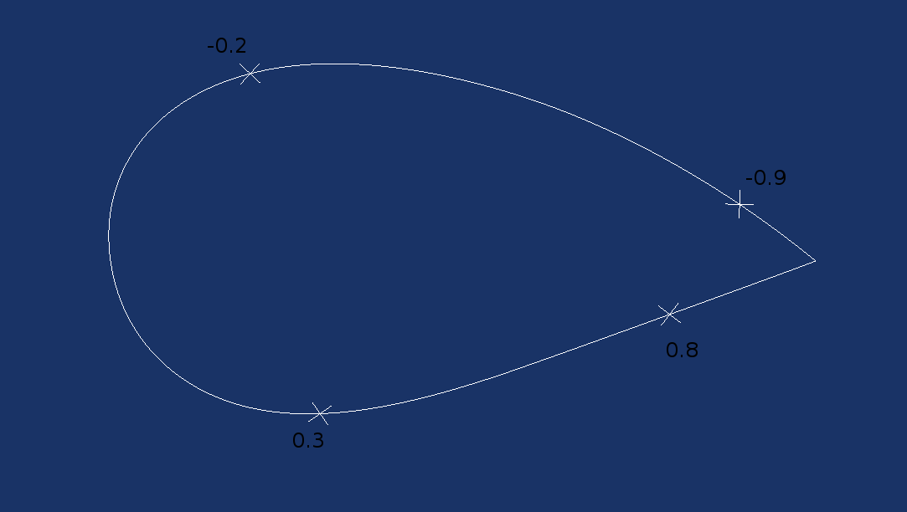

Airfoils
========


Airfoils are treated like PolyLines and as such you can slice and so on...

further on an airfoil you can get a point for an x value starting from top-back via the nose to the bottom-back

```
>>>prof = openglider.airfoil.Profile2D.compute_naca(2112)
>>>prof(-0.2)
58.47004738468069
>>>ik=prof(0.2)
>>>ik
139.57871747207429
>>>prof[ik]
array([ 0.2       , -0.03762874])
```



