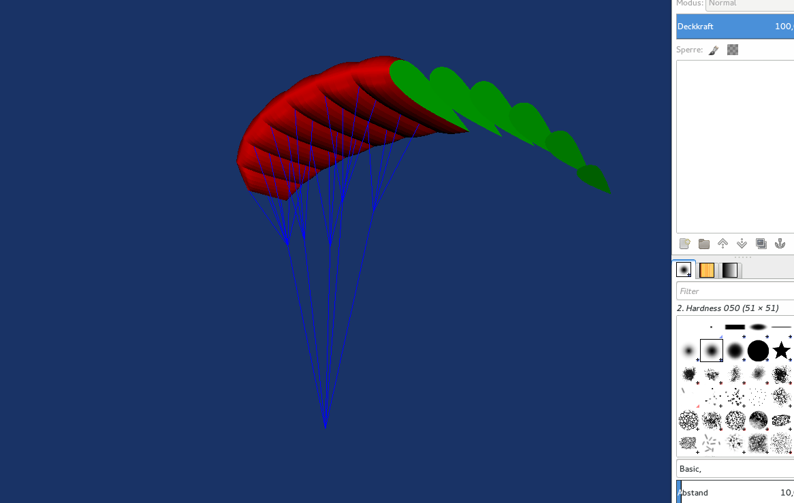

Glider
======



A glider consists of the following elements:

* cells
* ribs
* lineset

```
import openglider.glider as glider

# see ribs/cells for how to create ribs cells
glider = glider(cells, lineset)

print(glider.area)
glider.area=19  # sqm
glider.aspect_ratio = 7
```