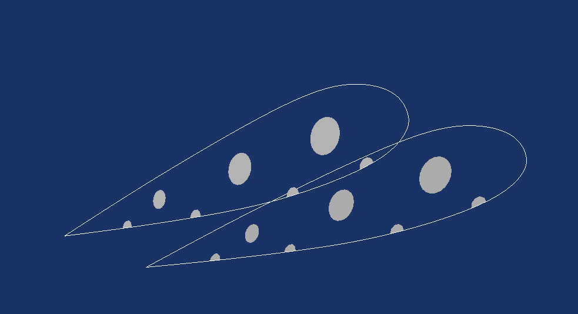

Ribs
====



```
import openglider.glider as glider
from openglider.airfoil import Profile2D

airfoil = Profile2D.compute_nasa(2200)
rib = glider.Rib(airfoil, [0,0,0], arc_ang=np.pi/4, aoa_absolute=np.pi/16)
 
print(rib.align([1,0]))
```